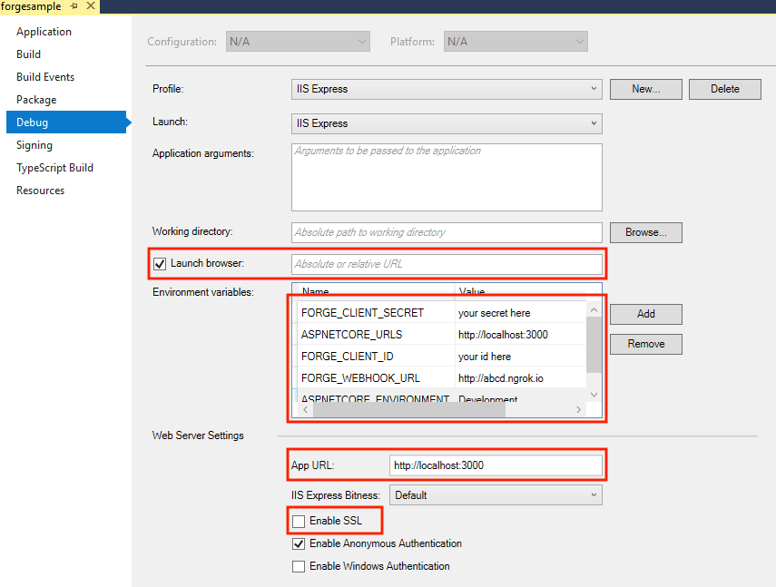

# bim360-csharp-approval.process

***
### Work in progress, not yet complete
***


[](http://developer.autodesk.com/)
[](http://developer.autodesk.com/)
[](http://developer.autodesk.com/)


[](http://developer.autodesk.com/)


[](http://opensource.org/licenses/MIT)

# Description

This sample contains a public interface that allows upload a file to an OSS Bucket. A Design Automation workitem is triggered and extract text and hatch information into a JSON file, the results are saved into a AWS S3 Bucket (temporary). This is used for validation. The user can then upload the file to a BIM 360 Folder. A side recurrent job checks for new issues on that file and notifies the user by SMS.

# Setup

## Prerequisites

1. **Forge Account**: Learn how to create a Forge Account, activate subscription and create an app at [this tutorial](http://learnforge.autodesk.io/#/account/). 
2. **Visual Studio**: Either Community (Windows) or Code (Windows, MacOS).
3. **.NET Core** basic knowledge with C#
4. **ngrok**: Routing tool, [download here](https://ngrok.com/)
5. **MongoDB**: noSQL database, [learn more](https://www.mongodb.com/). Or use a online version via [Mongo Altas](https://www.mongodb.com/cloud/atlas) (this is used on this sample)
6. **AWS Account**: S3 buckets are used to store result files
7. **AutoCAD** 2019: required to compile changes into the plugin
8. **Twillio**: used to send SMS notifications

## Running locally

Clone this project or download it. It's recommended to install [GitHub desktop](https://desktop.github.com/). To clone it via command line, use the following (**Terminal** on MacOSX/Linux, **Git Shell** on Windows):

    git clone https://github.com/augustogoncalves/bim360-csharp-approval.process


**Visual Studio** (Windows):

Right-click on the project, then go to **Debug**. Adjust the settings as shown below. 

 

**Visual Sutdio Code** (Windows, MacOS):

Open the folder, at the bottom-right, select **Yes** and **Restore**. This restores the packages (e.g. Autodesk.Forge) and creates the launch.json file. See *Tips & Tricks* for .NET Core on MacOS.


**MongoDB**

[MongoDB](https://www.mongodb.com) is a no-SQL database based on "documents", which stores JSON-like data. For testing purpouses, you can either use local or live. For cloud environment, try [MongoDB Atlas](https://www.mongodb.com/cloud/atlas) (offers a free tier). With MongoDB Atlas you can set up an account for free and create clustered instances, intructions:

1. Create a account on MongoDB Atlas.
2. Under "Collections", create a new database (e.g. named `designcheck`) with a collection (e.g. named `users`).
3. Under "Command Line Tools", whitelist the IP address to access the database, [see this tutorial](https://docs.atlas.mongodb.com/security-whitelist/). If the sample is running on Heroku, you'll need to open to all (IP `0.0.0.0/0`). Create a new user to access the database. 

At this point the connection string should be in the form of `mongodb+srv://<username>:<password>@clusterX-a1b2c4.mongodb.net/validation?retryWrites=true`. [Learn more here](https://docs.mongodb.com/manual/reference/connection-string/)

There are several tools to view your database, [Robo 3T](https://robomongo.org/) (formerly Robomongo) is a free lightweight GUI that can be used. When it opens, follow instructions [here](https://www.datduh.com/blog/2017/7/26/how-to-connect-to-mongodb-atlas-using-robo-3t-robomongo) to connect to MongoDB Atlas.

**AWS Account**

Create an AWS Account, allow API Access and S3 Full Access (write) permissions, the `access key` and `secret key` will be used on this sample.

**ngrok**

Run `ngrok http 3000 -host-header="localhost:3000"` to create a tunnel to your local machine, then copy the address into the `FORGE_WEBHOOK_URL` environment variable.

**Environment variables**

At the `.vscode\launch.json`, find the env vars and add your Forge Client ID, Secret and callback URL. Also define the `ASPNETCORE_URLS` variable. The end result should be as shown below:

```json
"env": {
    "ASPNETCORE_ENVIRONMENT": "Development",
    "ASPNETCORE_URLS" : "http://localhost:3000",
    "FORGE_CLIENT_ID": "your id here",
    "FORGE_CLIENT_SECRET": "your secret here",
    "FORGE_CALLBACK_URL": "http://localhost:3000/api/forge/callback/oauth",
    "OAUTH_DATABASE": "mongodb+srv://<username>:<password>@clusterX-a1b2c4.mongodb.net/validation?retryWrites=true",
    "FORGE_WEBHOOK_URL": "your ngrok address here: e.g. http://abcd1234.ngrok.io",
    "AWS_ACCESS_KEY": "your AWS access key here",
    "AWS_SECRET_KEY": "your AWS secret key here",
    "USERID": "Autodesk ID that represents the generic user",
    "TWILIO_FROM_NUMBER": "Phone number",
    "TWILIO_TOKEN", "Token",
    "TWILIO_ACCOUNT_SID": "Account SID"
},
```

**AutoCAD plugin**

Any changes on these plugins will require to create a new .bundle, the **Post-build** event should create it. The `BUILD` action copy all files to the bundle folder, generate a .zip and copy to the webapp folder. It requires [7-zip](https://www.7-zip.org/) tool.

**Run**

Start the app.

Open `http://localhost:3000` to upload a new file and start the validation.

## License

This sample is licensed under the terms of the [MIT License](http://opensource.org/licenses/MIT). Please see the [LICENSE](LICENSE) file for full details.

## Written by

Augusto Goncalves [@augustomaia](https://twitter.com/augustomaia), [Forge Partner Development](http://forge.autodesk.com)
